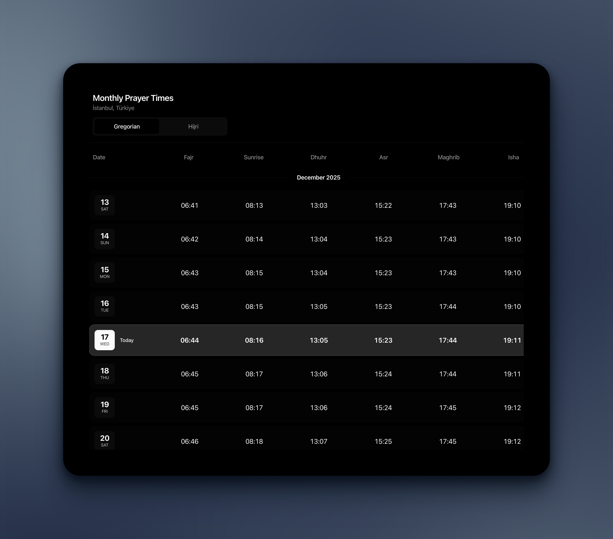
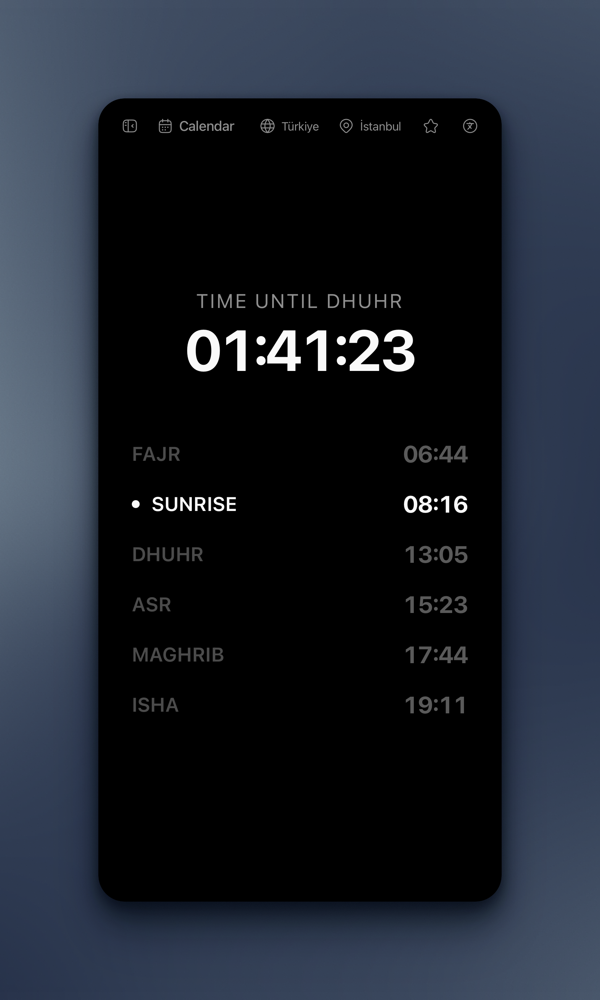
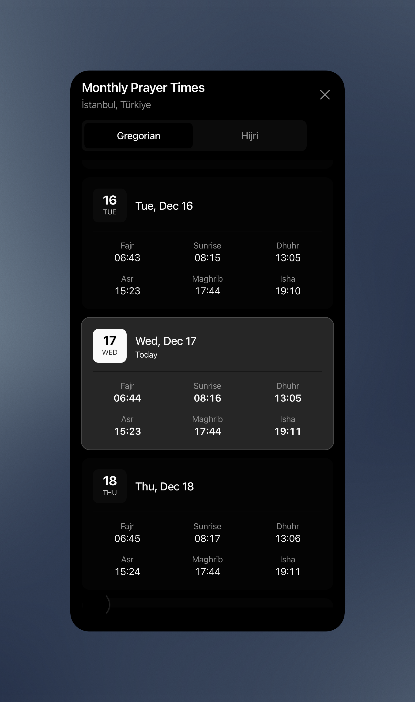

<div align="center">
  
  
# Waqt - Prayer Times


  


Prayer times. That's it.
</div>

## 📸 Screenshots

### Desktop
| | |
|:---:|:---:|
|  |  |

### Mobile
| | |
|:---:|:---:|
|  |  |

## Features

- **Real-time countdown** - Live countdown to the next prayer time
- **Offline support** - Works great as a PWA, accessible even without internet after initial load
- **Multi-language** - Supports English, Turkish, Arabic, German, and French (and more soon)
- **Location-based** - Automatic location detection with manual selection for any city
- **Monthly calendar** - View prayer times for the entire month with Gregorian/Hijri calendar toggle
- **Starred locations** - Save your favorite locations for quick access
- **Mobile optimized** - Responsive design that works beautifully on all devices
- **Simple & fast** - Minimalist interface focused on what matters

## Run locally

### Prerequisites

- Node.js 18+ and npm/yarn/pnpm

### Installation

1. Clone the repository:
```bash
git clone https://github.com/blcnyy/waqt.git
cd waqt
```

2. Install dependencies:
```bash
npm install
```

3. Run the development server:
```bash
npm run dev
```

4. Open [http://localhost:3000](http://localhost:3000) in your browser

## 🛠️ Tech Stack

- **Next.js 16** - React framework
- **TypeScript** - Type safety
- **Tailwind CSS** - Styling
- **Framer Motion** - Smooth animations
- **shadcn/ui** - Accessible components
- **Hugeicons** - Beautiful icons

## 📱 PWA Support

Waqt is a Progressive Web App. After visiting the site, you can:
- Install it on your device (mobile or desktop)
- Use it offline after the initial load
- Access prayer times without an internet connection

## 🌍 Supported Locations

- **Türkiye** - All 81 provinces with accurate prayer times provided by **T.C. Diyanet İşleri Başkanlığı**
- **Worldwide** - Prayer times for any city worldwide via [AlAdhan API](https://aladhan.com/prayer-times-api)

## Contribute

### Reporting Issues

Found a bug or have a feature request? Please open an issue with:
- Clear description of the problem or feature
- Steps to reproduce (for bugs)
- Expected vs actual behavior
- Screenshots if applicable

### Making Changes

1. **Fork the repository** and clone your fork:
```bash
git clone https://github.com/blcnyy/waqt.git
cd waqt
```

2. **Install and run**:
```bash
npm install
npm run dev
```

3. **Create a branch** for your changes:
```bash
git checkout -b feature/your-feature-name
# or
git checkout -b fix/your-bug-fix
```

4. **Make your changes**:
   - Follow the existing code style
   - Write clean, readable code
   - Keep components simple and focused!

5. **Test your changes**:
   - Run `npm run dev` and test manually
   - Ensure the app works on mobile and desktop
   - Test offline functionality if relevant
   - Check that translations work for all languages

6. **Commit your changes**:
```bash
git add .
git commit -m "Add: description of your changes"
```

7. **Push and create a Pull Request**:
```bash
git push origin feature/your-feature-name
```

Then open a PR on GitHub with:
- Clear description of what changed
- Why the change was made
- Any relevant screenshots

### Code Style Guidelines

- **TypeScript** - Use types, avoid `any`
- **Component structure** - Keep components small and focused
- **Naming** - Use descriptive, clear names
- **Formatting** - Follow existing patterns

### Areas for Contribution

- **Translations** - Add or improve translations for existing languages
- **New languages** - Add support for additional languages
- **UI improvements** - Enhance mobile experience or accessibility
- **Performance** - Optimize loading times or bundle size
- **Bug fixes** - Fix issues reported in GitHub Issues

## 📄 License

This project is open source and available under the [MIT License](LICENSE).

Copyright (c) 2025 [Ömer Balkan](https://github.com/blcnyy)

## 🙏 Acknowledgments

- Prayer times data from [T.C. Diyanet İşleri Başkanlığı](https://diyanet.gov.tr) (Türkiye) and [AlAdhan API](https://aladhan.com) (worldwide)
- Icons from [Hugeicons](https://hugeicons.com)
